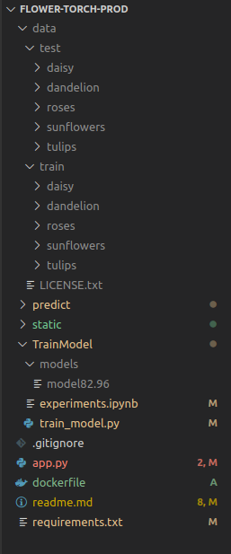

# Flower-Torch-Prod

Passos para executar o projeto:
1. Baixe os dados necessários para treinamento do modelo, salve os dados na raiz do projeto dentro de uma pasta chamada <mark>data</mark>.

2. Crie a pasta <mark>models</mark> dentro de <mark>TrainModel</mark>.

3. Execute o arquivo <mark>train_model.py</mark> passando o como argumento a acurácia mínima desejada. Para uma acurácia mínima de 85% basta executar o código abaixo:

```bash
python TrainModel/train_model.py 0.85
```

4. Assim que o modelo que obtiver o modelo usando o código acima basta rodar os seguinte códigos no terminal.

```bash
$ docker build -t flower-torch:latest .
$ docker run -p 5000:5000 flower-torch:latest
```

Refêrencia da estrutura do projeto:

